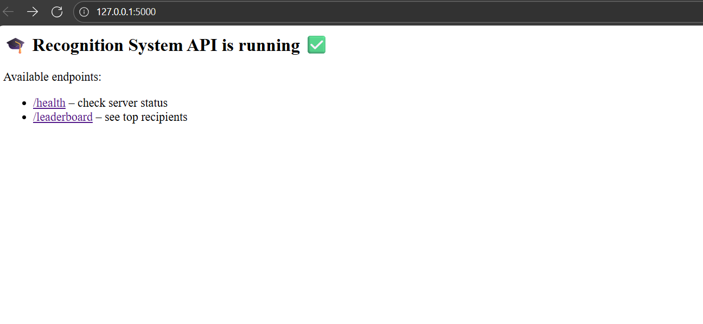
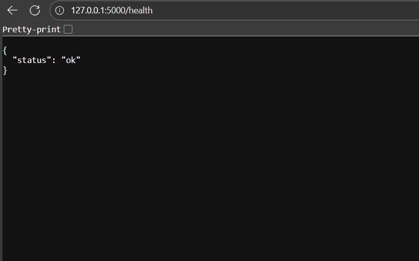
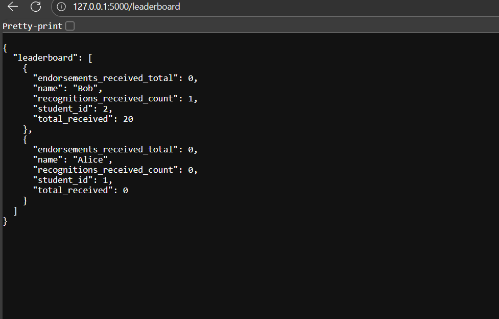

Below is a complete `src/readme.md` you can copy into your repository. It contains setup, run instructions, API documentation, and sample requests/responses (PowerShell-friendly examples included).

---

# Recognition App (Flask + SQLite)

# Overview

A small REST API that implements a student recognition system with:

* Recognition: students transfer credits to peers
* Endorsements: students can endorse recognitions (one endorsement per person per recognition)
* Redemption: students redeem received credits for vouchers (₹5 per credit)
* Monthly reset with carry-forward (up to 50 credits)
* Leaderboard: ranking by total credits received

Built with: Python + Flask + Flask-SQLAlchemy + SQLite

---

# Requirements / Compatibility

* Python 3.10 or 3.11 recommended.
* SQLite (bundled with Python).
* If you use Python 3.13 you may encounter SQLAlchemy compatibility issues — see note below.

Note on SQLAlchemy & Python 3.13:
If you see errors from SQLAlchemy on very new Python versions, either:

* Recreate the virtualenv with Python 3.11, or
* Install a compatible SQLAlchemy build: `pip install --force-reinstall SQLAlchemy==2.0.41`

---

# Setup

1. Clone repository and change to project folder:

```bash
# from repo root
cd src
```

2. Create & activate a virtual environment:

Linux / macOS:

```bash
python3 -m venv venv
source venv/bin/activate
```

Windows PowerShell:

```powershell
python -m venv .venv
.\.venv\Scripts\Activate.ps1
```

3. Install dependencies:

```bash
pip install -r requirements.txt
```

If you hit SQLAlchemy issues on Python 3.13:

```powershell
pip install --force-reinstall SQLAlchemy==2.0.41 Flask==2.2.5 Flask-SQLAlchemy==3.0.3
```

---

# Run

From `src/`:

```bash
python app.py
```

* The app will create `src/app.db` on first run.
* By default it runs in debug mode on `http://127.0.0.1:5000`.

To stop the server: press `CTRL+C`.

Sample Response 
* Serving Flask app 'app'
 * Debug mode: on
WARNING: This is a development server. Do not use it in a production deployment. Use a production WSGI server instead.
 * Running on all addresses (0.0.0.0)
 * Running on http://127.0.0.1:5000
se a production WSGI server instead.
 * Running on all addresses (0.0.0.0)
 * Running on http://127.0.0.1:5000
 * Running on all addresses (0.0.0.0)
 * Running on http://127.0.0.1:5000
 * Running on http://127.0.0.1:5000
 * Running on http://192.168.29.9:5000
 * Running on http://192.168.29.9:5000
Press CTRL+C to quit
 * Restarting with watchdog (windowsapi)
 * Debugger is active!
 * Debugger PIN: 834-666-869
127.0.0.1 - - [13/Nov/2025 08:17:43] "GET / HTTP/1.1" 200 -
127.0.0.1 - - [13/Nov/2025 08:17:47] "GET /health HTTP/1.1" 200 -
127.0.0.1 - - [13/Nov/2025 08:17:50] "GET /leaderboard HTTP/1.1" 200 -
127.0.0.1 - - [13/Nov/2025 08:19:15] "POST /recognitions HTTP/1.1" 400 -

# API Endpoints

> Use Postman, Git Bash (curl) or PowerShell (`Invoke-WebRequest`) to call endpoints. PowerShell examples are provided where helpful.

## 1. Health

**GET** `/health`
Check if the service is up.

**PowerShell**

```powershell
Invoke-WebRequest -Uri http://127.0.0.1:5000/health -Method GET | Select-Object -ExpandProperty Content
```

**Response**

```json
{"status":"ok"}
```

---

## 2. Create student

**POST** `/students`
Create a new student. Each new student starts with a monthly sendable balance of 100 credits.

**Request body**

```json
{ "name": "Alice" }
```

**PowerShell**

```powershell
Invoke-WebRequest -Uri http://127.0.0.1:5000/students -Method POST `
  -Headers @{ "Content-Type" = "application/json" } `
  -Body '{"name":"Alice"}' | Select-Object -ExpandProperty Content
```

**Sample response**

```json
{
  "student": {
    "id": 1,
    "name": "Alice",
    "sendable_balance": 100,
    "monthly_sent": 0,
    "redeemable_balance": 0,
    "total_received": 0,
    "last_reset": "2025-11-13",
    "created_at": "2025-11-13T08:00:00.000000"
  }
}
```

---

## 3. Get student

**GET** `/students/<id>`
Fetch student's balances and metadata.

**PowerShell**

```powershell
Invoke-WebRequest -Uri http://127.0.0.1:5000/students/1 -Method GET | Select-Object -ExpandProperty Content
```

**Sample response**

```json
{
  "student": {
    "id": 1,
    "name": "Alice",
    "sendable_balance": 80,
    "monthly_sent": 20,
    "redeemable_balance": 10,
    "total_received": 30,
    "last_reset": "2025-11-01",
    "created_at": "2025-11-01T09:00:00.000000"
  }
}
```

---

## 4. Create recognition (send credits)

**POST** `/recognitions`
Send credits from one student to another.

**Business rules enforced**

* Self-recognition not allowed.
* Sender must have enough `sendable_balance`.
* Sender monthly sending cap = 100 credits.

**Request body**

```json
{
  "sender_id": 1,
  "receiver_id": 2,
  "amount": 20,
  "message": "Great teamwork!"
}
```

**PowerShell**

```powershell
Invoke-WebRequest -Uri http://127.0.0.1:5000/recognitions -Method POST `
  -Headers @{ "Content-Type" = "application/json" } `
  -Body '{"sender_id":1,"receiver_id":2,"amount":20,"message":"Great teamwork!"}' `
  | Select-Object -ExpandProperty Content
```

**Sample response**

```json
{
  "recognition": {
    "id": 1,
    "sender_id": 1,
    "receiver_id": 2,
    "amount": 20,
    "message": "Great teamwork!",
    "created_at": "2025-11-13T08:05:00.000000",
    "endorsement_count": 0
  }
}
```

**Error examples**

* Self recognition:

```json
{"error":"self-recognition not allowed"}
```

* Insufficient balance:

```json
{"error":"insufficient sendable balance"}
```

* Monthly cap exceeded:

```json
{"error":"monthly sending limit exceeded"}
```

---

## 5. Endorse a recognition

**POST** `/recognitions/<recognition_id>/endorse`
Endorse an existing recognition. Each `endorser_id` may endorse a recognition only once.

**Request body**

```json
{ "endorser_id": 3 }
```

**PowerShell**

```powershell
Invoke-WebRequest -Uri http://127.0.0.1:5000/recognitions/1/endorse -Method POST `
  -Headers @{ "Content-Type" = "application/json" } `
  -Body '{"endorser_id":3}' | Select-Object -ExpandProperty Content
```

**Sample success**

```json
{
  "endorsement": {
    "id": 1,
    "recognition_id": 1,
    "endorser_id": 3,
    "created_at": "2025-11-13T08:10:00.000000"
  },
  "new_endorsement_count": 1
}
```

**Error**

```json
{"error":"endorser has already endorsed this recognition"}
```

---

## 6. Redeem credits

**POST** `/students/<id>/redeem`
Redeem credits that the student has received. Voucher value = `credits * ₹5`. Redeemed credits are deducted from `redeemable_balance`.

**Request body**

```json
{ "credits": 10 }
```

**PowerShell**

```powershell
Invoke-WebRequest -Uri http://127.0.0.1:5000/students/2/redeem -Method POST `
  -Headers @{ "Content-Type" = "application/json" } `
  -Body '{"credits":10}' | Select-Object -ExpandProperty Content
```

**Sample response**

```json
{
  "redemption": {
    "id": 1,
    "student_id": 2,
    "credits": 10,
    "voucher_value": 50,
    "created_at": "2025-11-13T08:15:00.000000"
  }
}
```

**Error**

```json
{"error":"insufficient redeemable credits"}
```

---

## 7. Leaderboard

**GET** `/leaderboard?limit=10`
Return top recipients ranked by `total_received` (descending). Tie-breaker: `student_id` ascending. Also includes recognition and endorsement counts.

**PowerShell**

```powershell
Invoke-WebRequest -Uri "http://127.0.0.1:5000/leaderboard?limit=5" -Method GET | Select-Object -ExpandProperty Content
```

**Sample response**

```json
{
  "leaderboard": [
    {
      "student_id": 2,
      "name": "Bob",
      "total_received": 20,
      "recognitions_received_count": 1,
      "endorsements_received_total": 1
    },
    ...
  ]
}
```

---

# 8. Admin: Force monthly reset (testing)

**POST** `/admin/reset_all`
Applies monthly reset logic (carry-forward up to 50) to all students. Intended for testing — in production this would run as a scheduled job.

**PowerShell**

```powershell
Invoke-WebRequest -Uri http://127.0.0.1:5000/admin/reset_all -Method POST | Select-Object -ExpandProperty Content
```

Behavior

* For each student, if month changed since `last_reset`, set:

  * `sendable_balance = 100 + min(previous_unused_balance, 50)`
  * `monthly_sent = 0`
  * `last_reset` updated to today

---

# Testing (quick checklist)

1. Start server: `python app.py`
2. Run PowerShell commands from this README or use Postman/Git Bash.
3. Verify flows:

   * Create students → check `sendable_balance=100`
   * Send recognition → check sender & receiver balances
   * Endorsement → unique endorsement enforced
   * Redemption → voucher value correct & balances updated
   * Monthly reset → carry-forward rule applied correctly
   * Leaderboard → correct ordering & counts

---

## Test files included

* `test-cases/test-cases.txt` — step-by-step PowerShell commands and expectations
* `prompt/llm-chat-export.txt` — (include your full, unredacted LLM conversation if you used any)

---

# DB inspection (optional)

Open `src/app.db` with any SQLite browser or run `sqlite3 src/app.db`:

```sql
.tables
SELECT id, name, sendable_balance, monthly_sent, redeemable_balance, total_received, last_reset FROM student;
SELECT * FROM recognition;
SELECT * FROM endorsement;
SELECT * FROM redemption;
```

---

# Troubleshooting

* If `ImportError` or SQLAlchemy assertions occur, recreate the venv with Python 3.11 or install `SQLAlchemy==2.0.41`.
* If PowerShell rejects `curl` style flags, use `Invoke-WebRequest` as shown above.
* If port 5000 is busy, change `app.run(port=...)` in `app.py`.


#App backend running locally 





